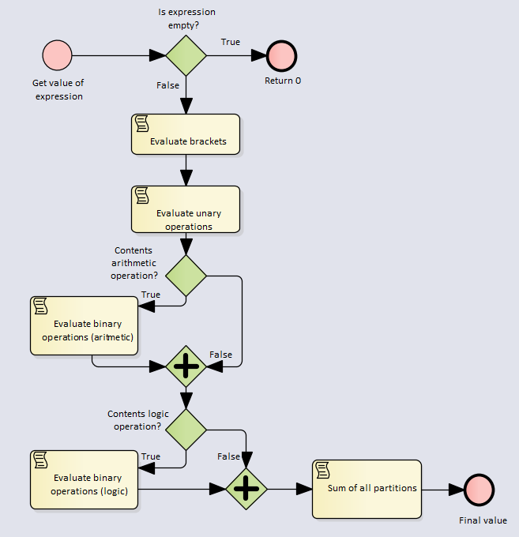
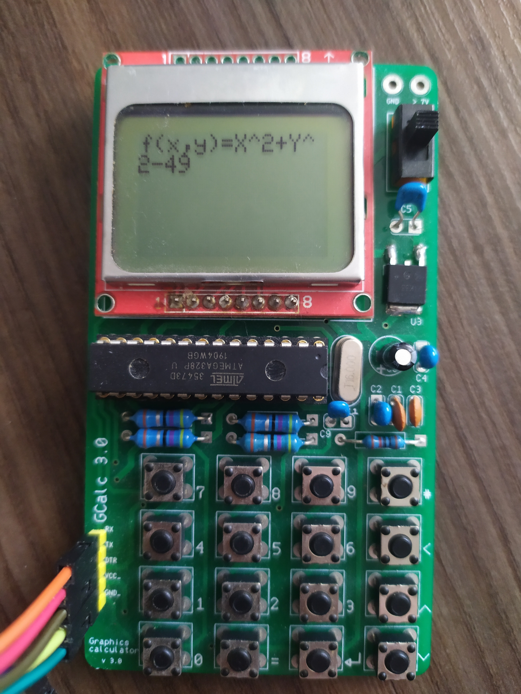
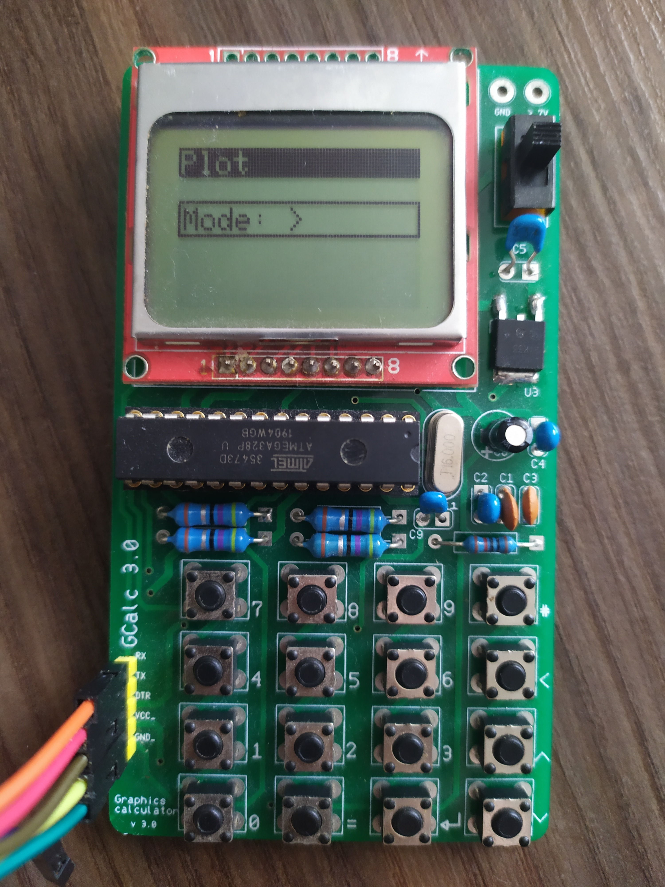
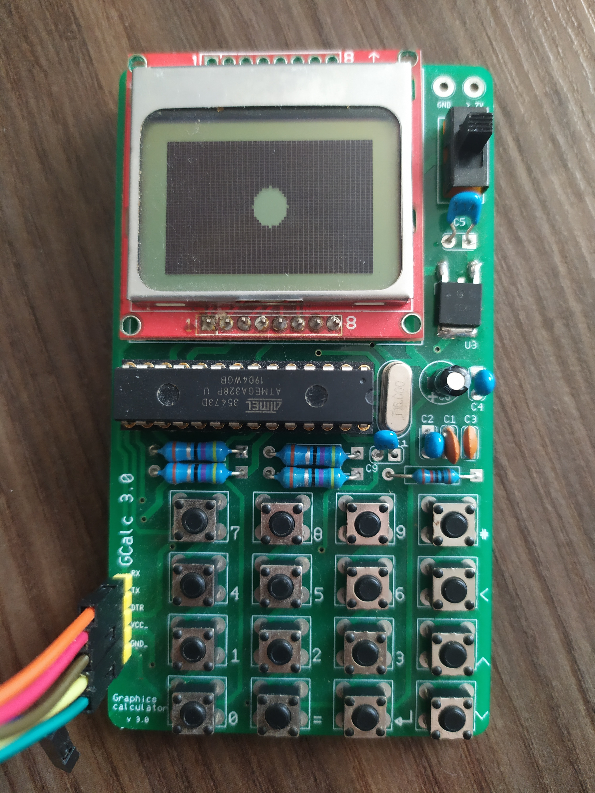
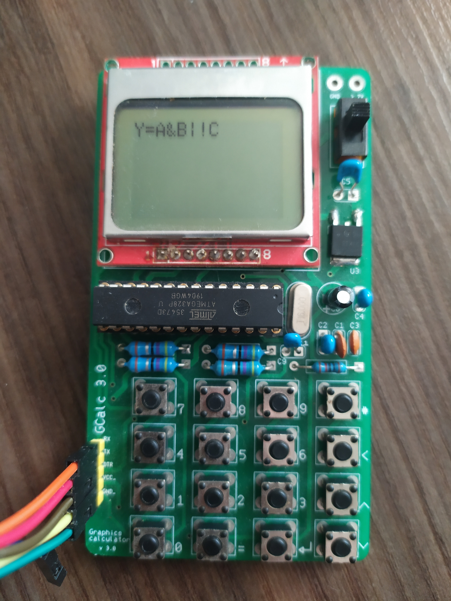
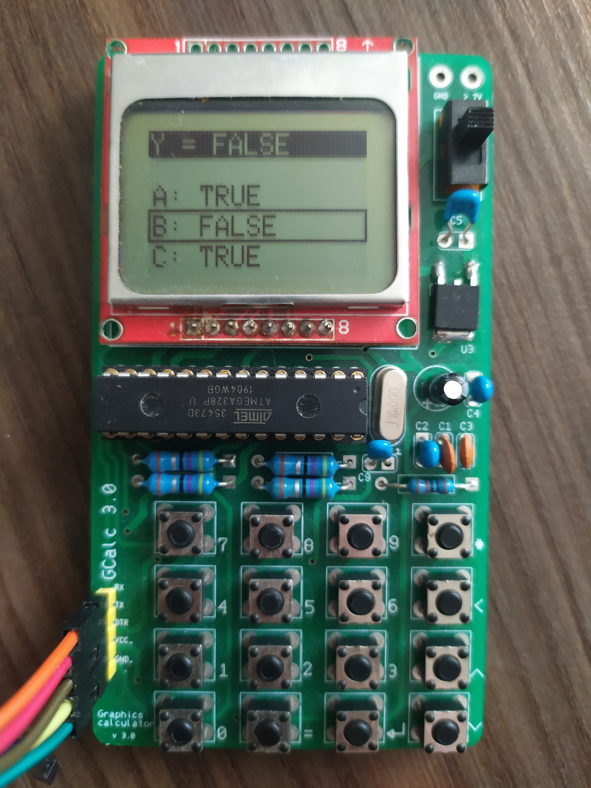
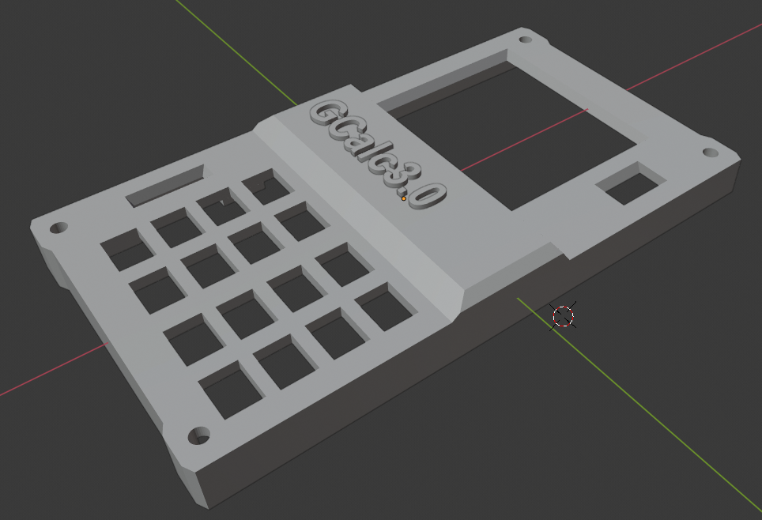
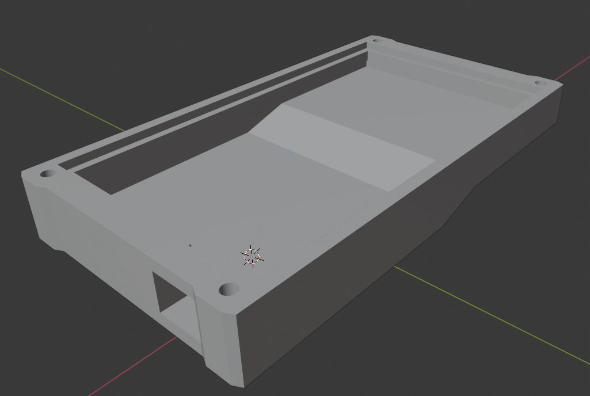

# Graphing-Calculator
Graphing calculator using __atmega328p__. Calculator is able to calculating mathematical and logical expressions. As display use __nokia 5110__ and for input use __4x4 array of micro switches__ + 1x power switch. Input input voltage of pcb board is 7-35V.


## Calculator modes
 * __Calculator__ - calculate value of mathematical expression
 * __Grapher__ - drawing graphs of typed functins f(x)
 * __Ploter__ - ploting graphs of typed functins f(x, y)
 * __Logic parser__ - user type logical expression with variables and constants and than changing value of variables and calculator showing final value of expression
 
## Expression parser
Parser in programed in c++ and work for arduino and desktop aplications (with some corestions). This parser first replace all constants (e, pi) by numbers and after that evaluate all brackets than all unary operations, binary operations and on end sum all particions of expression. 



### Supported operations
* Math
  * __Default operations:__ +, -, *, /, ^
  * __Brackets:__ (, ), |
  * __Functions:__ sin, cos, tan, asin, acos, atan, log, log10
    * All functions hava specific ascii code in expression string
      ```c++
      #define SIN -128
      #define COS -127
      #define TG -126
      #define ASIN -125
      #define ACOS -124
      #define ATG -123
      #define LOG -122
      #define LOG10 -121
      #define PI -120
      ```
* Logic
  * __Not:__ !
  * __Or:__ |
  * __And:__ &
  * __Equivalency:__ =

### Main part of parser
Arguments are expression and bool logic + aritmetic. If bool logic is true then parser will parsing logic expression or if bool aritmetis is true then parser will parsing aritmetic expression. Both bool can be true in same time.

```c++
double ExpressionParser::getValueOfExpression(String expression, bool logic, bool aritmetic) {
	
	if (expression.length() == 0) {
		return 0.0;
	}

	expression = ExpressionParser::replaceVar(&expression, 'e', "2.71828");
	expression = ExpressionParser::replaceVar(&expression, PI, "3.14159");

	#ifdef DEBUG
		Serial.println("IN: " + expression);
	#endif

	//brackets
	ExpressionParser::bracket(&expression, logic, aritmetic);

	#ifdef DEBUG
		Serial.println("BRACKET: " + expression);
	#endif

	//unary operators: sin, cos, tg, asin, acos, atg, log, log10, not
	ExpressionParser::unaryOperator(&expression);

	#ifdef DEBUG
		Serial.println("UNARY: " + expression);
	#endif

	if (aritmetic) {
		//default math operation
		ExpressionParser::binaryOperations(&expression, '^', false);	//power 
		ExpressionParser::binaryOperations(&expression, '/', true);	//divide
		ExpressionParser::binaryOperations(&expression, '*', true);	//multiply
	}
	if (logic) {
		//logic operatores	
		ExpressionParser::binaryOperations(&expression, '&', true);	//logic and
		ExpressionParser::binaryOperations(&expression, '|', true);	//logic or
		ExpressionParser::binaryOperations(&expression, '=', true);	//equivalency
	}

	#ifdef DEBUG
		Serial.println("SUM: " + expression);
	#endif

	//sum all values and return
	return ExpressionParser::sum(&expression);
}
```

## Mode: Calculator


## Mode: Grapher


## Mode: Ploter



## Mode: Logic parser



## Circuit schematic
Switches in schematic are represented by resistores. Input voltage must be heigher than 7V. Compunent __U3__ 7805 make 5V for pcb and __U4__ TS1117BCW33 make 3.3V for display __U2__ Nokia5110. Resistores __R7__ and __R6__ are for input voltage measuring. On right side of schematics is 4x4 button array. Down side are inputs pins for programing (Vcc, Gnd, Tx, Rx, Dtr). Crystal frequency: __16 MHz__.


## PCB design
One left side is top of pcb and on right is bottom. 
> Size: 100mm x 56.65mm


 
## Case model
Case of calculator is made for two parts (top and bottom), parts are connected together be four screws.

> Top


> Bottom



## Author
* Martin Krčma

## License
* This project is licensed under Apache License 2.0 - see the [LICENSE.md](./blob/master/LICENSE) file for details
